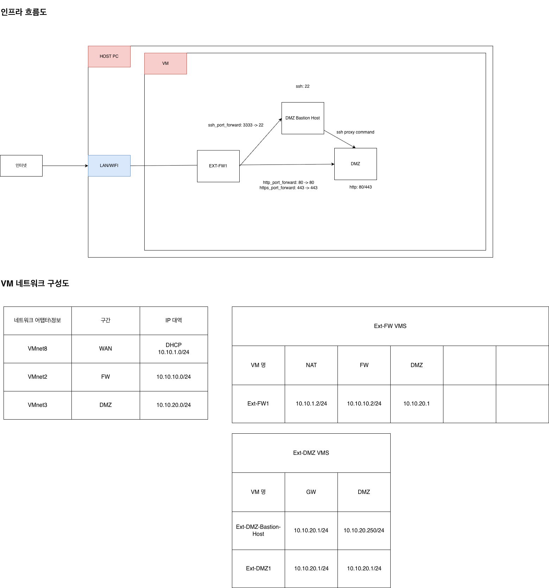

# oracle vm , multiple subnet, ipvs 를 이용한 망연계

# 구성도

# 계기
- 방화벽 장비를 역할 및 동작을 확인하고픔
- L7 라우팅이 아닌 L3 라우팅 확인하고픔 (외부 <-> 외부)
- L3 switch , VIP 확인하고픔
- dmz 망, 서버존 망을 구축하여 외부 접근 제어 구현
# 구현 모듈
- 학습 노트북이 Apple Silicon CPU 를 쓰므로 많이 제한적임
- VM 구현 application: 
  - VM Fusion: PORT FORWARDING, host only 설정 이슈 존재
  - UTM: NAT , host only
  - Virtual BOX: oracle vm
- 방화벽 application: IPFire
- OS : rhel10 CE
- DMZ-LB: IPVS + keepavlied
- DMZ/SZ Web-Server: Nginx

# 네트워크 아키텍처 설계 및 구성
- FW / VIP / LB / Backend 기반 3-Tier DMZ 네트워크 구성
- 구간별 네트워크 역할 분리 (WAN / DMZ / Backend / Host-only)
- multi-subnet 기반 라우팅 및 트래픽 흐름 설계

# Load Balancing / High Availability 구성
- IPVS 기반 L4 Load Balancer 구성 및 NAT 모드 적용
- VIP 기반 서비스 엔드포인트 구성 및 트래픽 분산 구조 설계
- Keepalived 기반 DMZ-LB 이중화 (Active/Backup) 구성
- VIP failover 구조 및 가용성 설계 적용

# 방화벽 및 네트워크 보안 구성
- IPFire 기반 RED / ORANGE / GREEN 영역 분리 설계
- NAT 및 내부망 정책 기반 트래픽 제어 구성
- DMZ 내부 / 외부 트래픽 정책 분리 및 접근 제어 설계

# 네트워크 문제 분석 및 트러블슈팅
- stateful connection tracking 기반 장애 분석 (conntrack)
- asymmetric routing 문제 직접 분석 및 해결
- VIP-LB-Backend 간 TCP 세션 흐름 분석
- NAT 환경에서의 return path 불일치 문제 해결

# 패킷 및 라우팅 레벨 디버깅
- tcpdump 기반 패킷 흐름 분석
- ip route / arp table 기반 L2/L3 경로 검증
- 인터페이스별 트래픽 흐름 검증 및 장애 지점 식별

# 핵심 기술 이해 영역
- L4 Load Balancing (IPVS NAT)
- Stateful firewall 동작 원리 (conntrack)
- Symmetric / asymmetric routing 구조 이해
- VIP 기반 서비스 아키텍처 설계
- DMZ 기반 multi-tier network segmentation