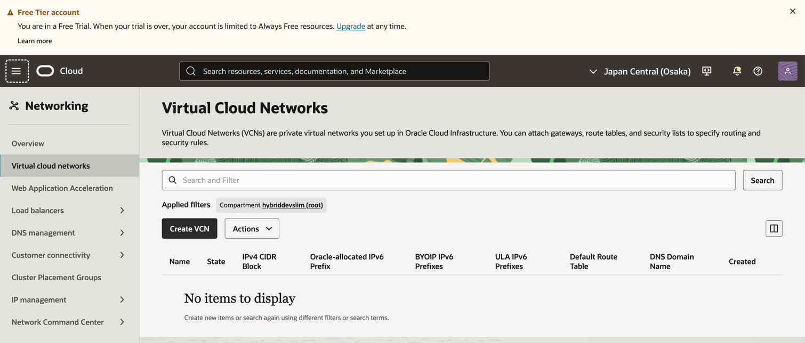
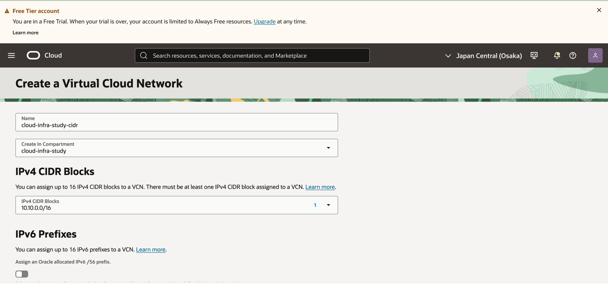
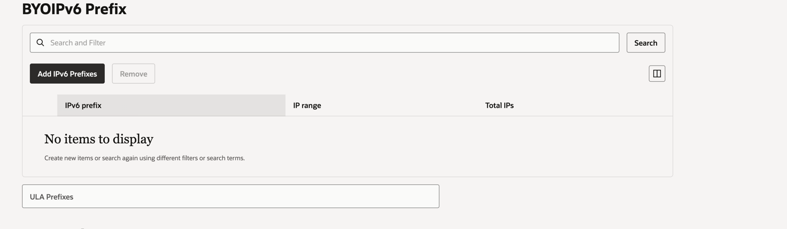
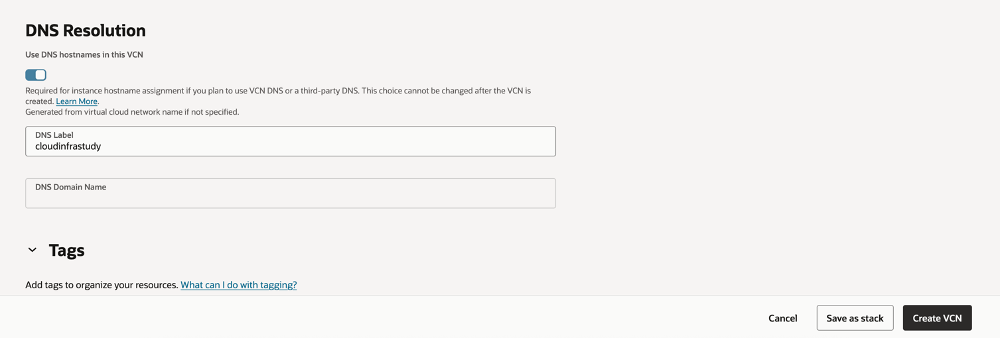
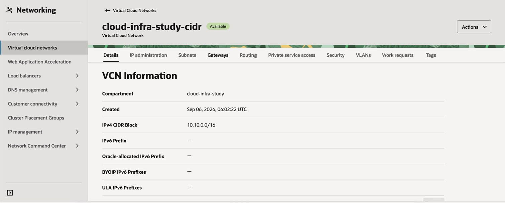
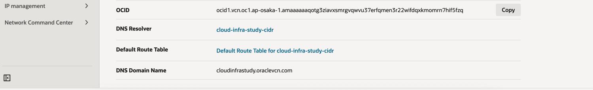

# vcn

# 정의
- VCN(Virtual Cloud Network)은 OCI에서 사용하는 가상 사설 네트워크입니다.
- 클라우드 안에 내가 직접 만드는 하나의 네트워크 공간입니다.

# 등록 방법
## vcn + cidr

## route table
- [route table 가이드](routing/README.md)
## subnet
- [subnet 가이드](subnet/README.md)
## gateway
- internet gateway 사용 (무료)