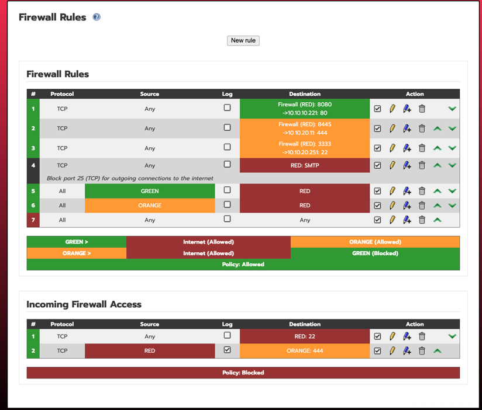
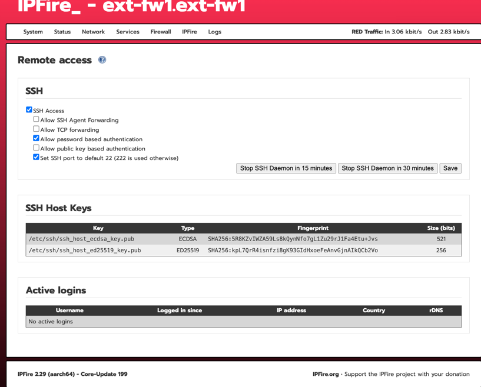

# 관리자웹 설정
- WebGUI → Firewall → Firewall Rules \
  Add new rule
- 방화벽 설정
  - 
  - 재기동
    ``` {shell} \
    sudo /etc/init.d/firewall restart
    ```
- SSH 설정
  - WebGUI → System -> SSH Access
    
- 방화벽 정책 확인

- 포트 포워딩  설정 필요