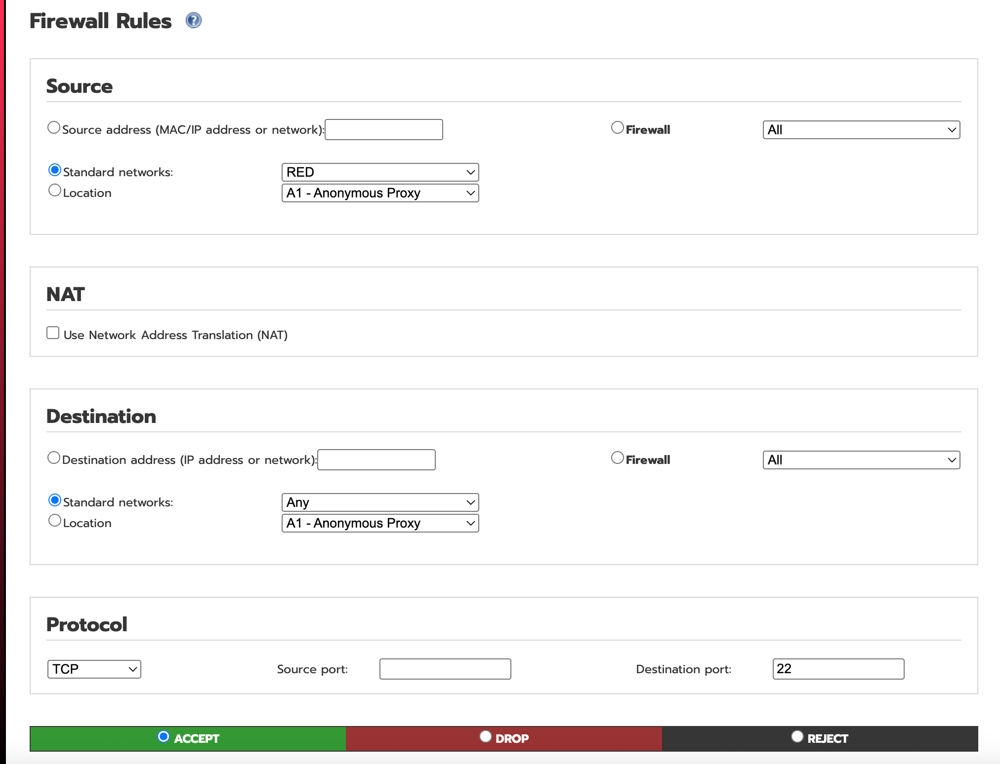
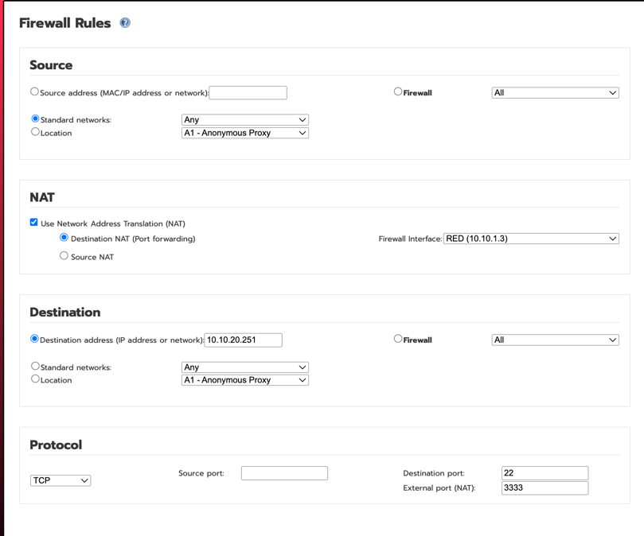
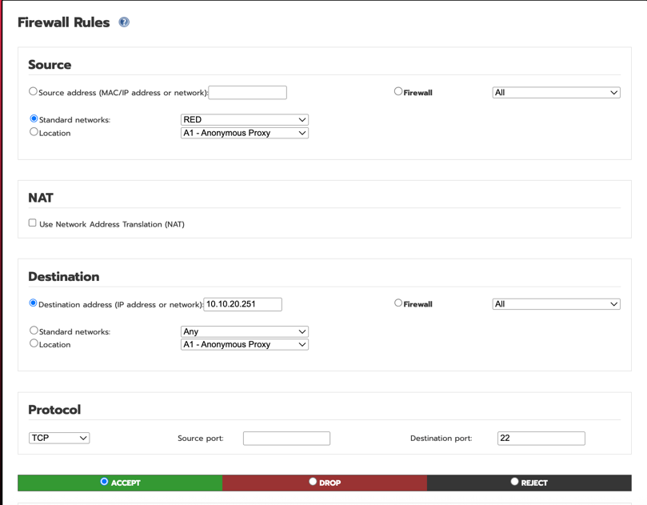
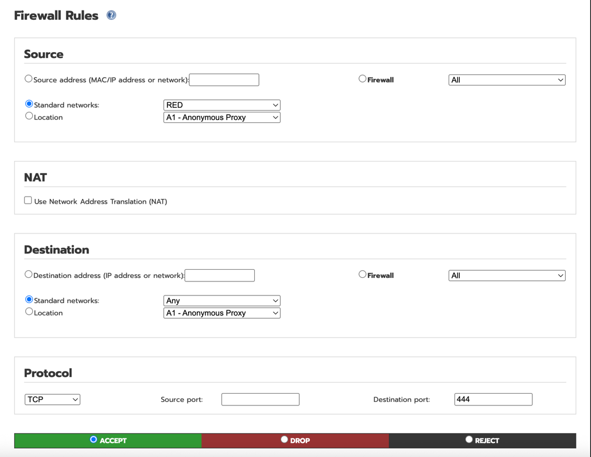
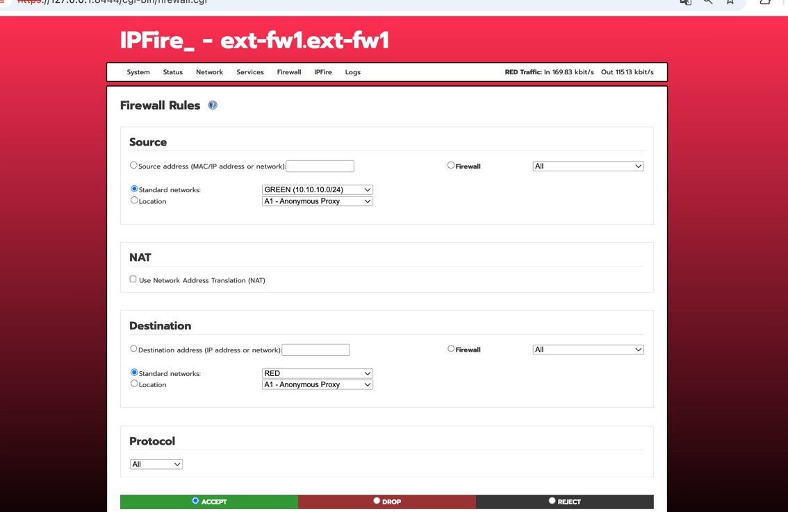
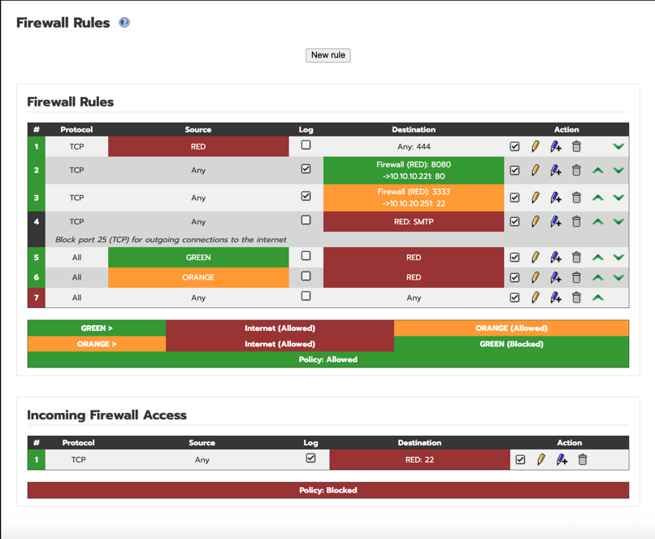
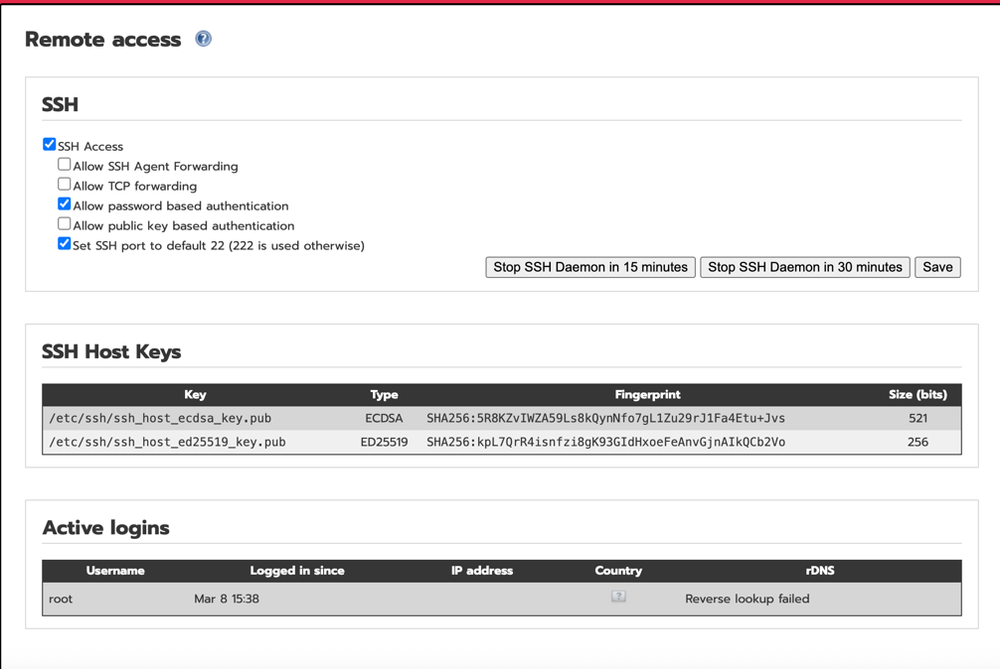

# 관리자웹 설정
- WebGUI → Firewall → Firewall Rules \
  Add new rule
- 방화벽 설정
  - SSH (외부 - NAT)
    
  - SSH (외부 - dmz-bastion)
    
    

  - 웹 (외부 - NAT)
    
  - dmz outbound ( 외부)
    
  - 목록
    
  - 재기동
    ``` {shell} \
    sudo /etc/init.d/firewall restart
    ```
- SSH 설정
  - WebGUI → System -> SSH Access
    
- 방화벽 정책 확인

- 포트 포워딩  설정 필요